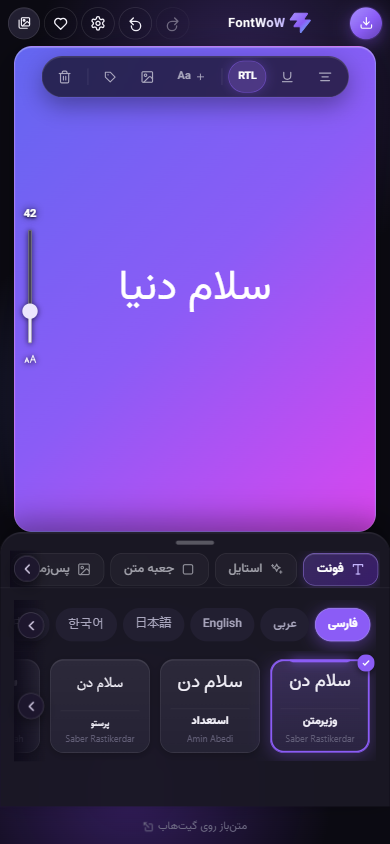
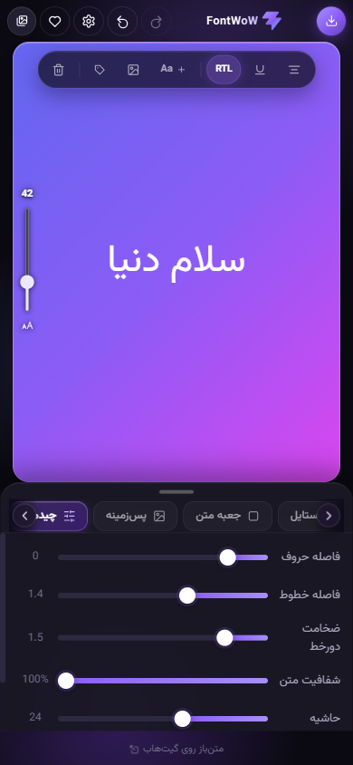
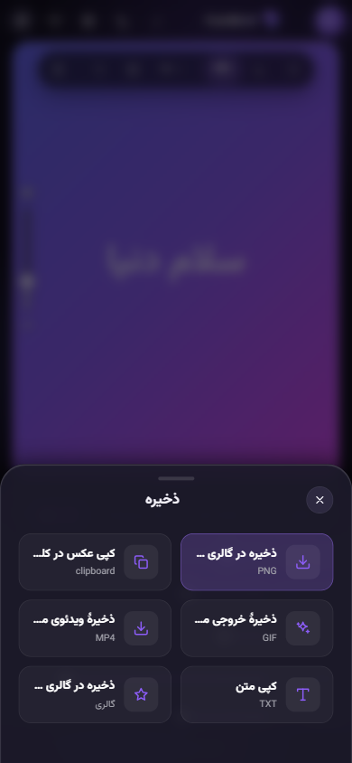

<div align="center">


# FontWoW

**استودیوی جادویی تایپوگرافی و متن‌آرایی آنلاین ⚡**

*بنویس، استایل بده، عکس بگیر، انیمیشن بساز و به اشتراک بگذار!*

---

[](https://github.com/omid-io/FontWoW.github.io/actions/workflows/deploy.yml)
[](https://github.com/omid-io/FontWoW.github.io/actions/workflows/release.yml)
[](https://react.dev/)
[](https://vitejs.dev/)
[](https://capacitorjs.com/)
[](LICENSE)

🌐 **[نسخه وب آنلاین استودیو](https://omid-io.github.io/FontWoW.github.io/)** | 📱 **[دریافت مستقیم نسخه اندروید (APK)](https://github.com/omid-io/FontWoW.github.io/releases/latest)**

<br />

<table>
  <tr>
    <td align="center">
      <kbd><b>ویرایشگر اصلی</b></kbd><br />
      
    </td>
    <td align="center">
      <kbd><b>چیدمان و ابعاد</b></kbd><br />
      
    </td>
    <td align="center">
      <kbd><b>خروجی و قالب‌ها</b></kbd><br />
      
    </td>
  </tr>
</table>

</div>

---

<div dir="rtl">

## 🌟 معرفی پروژه

**FontWoW (فونت واو)** یک ابزار متن‌آرایی و تایپوگرافی مدرن، متن‌باز، کاملاً کلاینت‌ساید (بدون نیاز به سرور) و بهینه‌سازی شده برای موبایل است. با فونت واو می‌توانید در چند ثانیه نوشته‌های خود را با افکت‌ها، فونت‌های متنوع فارسی و زبان‌های دیگر بیارایید، استیکرها و عکس‌های دلخواه اضافه کنید، آن‌ها را بچرخانید و جابه‌جا کنید و در نهایت خروجی‌های بسیار باکیفیت تصویری (PNG) یا انیمیشن‌های جذاب (GIF و ویدیوهای WebM) بگیرید.

> [!NOTE]
> 🔒 **حریم خصوصی ۱۰۰٪ تضمین شده:** تمام فعالیت‌ها، طرح‌های ذخیره‌شده، تنظیمات و فونت‌های شخصی شما فقط و فقط روی مرورگر یا حافظه دستگاه شما ذخیره می‌شوند (`localStorage` و حافظه محلی). هیچ داده‌ای به هیچ سروری ارسال نمی‌شود و برنامه کاملاً مستقل کار می‌کند.

---

## ✨ ویژگی‌های برجسته و امکانات

### 🔠 مدیریت و سفارشی‌سازی فونت
* **مجموعه‌ای از فونت‌های استاندارد:** شامل ده‌ها فونت پیش‌فرض و آماده، دسته‌بندی‌شده بر اساس زبان (فارسی، عربی، انگلیسی، ژاپنی، کره‌ای، چینی، روسی، هندی و غیره).
* **آپلود فونت شخصی:** پشتیبانی کامل از فرمت‌های رایج فونت (`ttf` / `otf` / `woff` / `woff2`)؛ فونت‌های آپلود شده در مرورگر شما ذخیره و به لیست فونت‌ها اضافه می‌شوند.
* **جستجو در گوگل فونت:** امکان جستجو و بارگیری مستقیم هزاران فونت از مخزن بزرگ Google Fonts با قابلیت کش هوشمند برای استفاده در دفعات بعدی بدون نیاز به اینترنت.
* **حمایت و پیشنهاد فونت:** فرم اختصاصی پیشنهاد فونت‌های جدید با پشتیبانی از تخفیف‌های ویژه (مانند حمایت ۲۰ درصدی فونت‌ایران برای خرید فونت‌ها).

### 🎨 استایل متن و جلوه‌های ویژه
* **قالب‌بندی استاندارد:** تنظیمات سریع برای ضخیم (Bold)، کج (Italic)، خط زیر (Underline)، تراز متن و شفافیت (Opacity).
* **افکت‌های متن پیشرفته (۱۴ افکت حرفه‌ای):**
  * 🔮 **نئون سایبر:** درخشش‌های نئونی چشم‌گیر با هاله نوری در تاریکی.
  * 🌈 **گرادیان‌های لوکس:** ۱۱ پالت رنگی داینامیک شامل طلایی لوکس، بنفش کیهانی، سایبرپانک، سان‌ست، هولوگرافیک و رنگین‌کمان.
  * 🧱 **سه‌بعدی ۳D:** حجم‌دهی برجسته با عمق و زاویه پرسپکتیو.
  * ⚡ **گلیچ دیجیتال:** جلوه سایبری و خطوط دیجیتالی ناپیوسته.
  * 📻 **پاپ‌آرت رترو:** سایه‌زنی نوستالژیک سبک کمیک و دهه ۸۰.
  * ✨ **درخشش رویایی (Soft Bloom):** هاله نوری محو و نرم پیرامون حروف.
  * 🔨 **برجسته و پرس (Emboss):** افکت بافت‌دار فرو رفته یا برجسته روی سطح.
  * 💧 **شیشه‌ای مایع (Liquid Glass):** انعکاس شفاف کریستالی.
  * 🔲 **توخالی مدرن (Outline):** استروک مینیمال بدون پرشدگی داخلی.
  * 🔥 **آتشین و گدازه:** حرارت گرم و افکت سایه ماگمایی.
  * 🎨 **کانتور دوگانه و کروم طلایی:** مرزبندی دولایه و بازتاب متالیک فلزی.
  * 🎬 **سایه سینمایی (Cinema Cast):** سایه نرم با زاویه پرسپکتیو استاندارد فیلم.
* **متن روی مسیر (Curve Text):** قرار دادن متن روی خطوط منحنی، قوس، موج و دایره با قابلیت تنظیم دقیق شدت و جهت انحنا.
* **ماسک تصویر (Image Fill):** پر کردن داخل حروف با تصویر پس‌زمینه دلخواه شما.
* **کشیدگی هوشمند:** کشیدن خودکار و هوشمند حروف فارسی (تطویل/کشش) برای زیبایی بیشتر چیدمان سنتی.

### 🖼️ جعبه‌های متن و قاب‌ها (۱۷ استایل آماده)
* **انواع استایل جعبه:** ساده، استوری اینستا، شیشه کریستال (Glassmorphism)، شیشه دودی، کپسولی مدرن، قاب خطی، قاب دوتایی، کادر نئونی، کارت نقل‌قول، پنجره سیستم‌عامل مک، ترمینال کد، یادداشت، حباب پیام، هایلایتر، کارت بلیطی، جعبه تیره و زیرخط ضخیم.
* **تنظیمات دقیق:** کنترل ابعاد جعبه، میزان حاشیه‌ها (Padding)، گوشه‌های گرد (Border Radius) و رنگ آن.

### ⚡ نوار ابزار سریع بوم و اسلایدر اندازه (Canvas Quick Bar)
* **نوار ابزار بالای بوم:** دسترسی فوری بدون نیاز به باز کردن منو برای حذف متن، برچسب‌ها و لیبل‌ها، افزودن تصویر از گالری، افزودن متن جدید (`Aa +`)، کلید تغییر جهت متن (`RTL / LTR`)، خط زیر و تراز متن.
* **اسلایدر عمودی فونت:** اسلایدر اختصاصی در لبه سمت چپ بوم با نمایش زنده و عددی دقیق اندازه قلم (Font Size) برای کنترل آنی ابعاد متن با یک لمس.

### 🖱️ سیستم ناوبری درگ افقی دسکتاپ (Desktop Drag-to-Scroll)
* **درگ روان در ویندوز و مرورگرها:** امکان کشیدن و اسکرول نوارهای افقی (تب‌ها، فونت‌ها، زبان‌ها، برچسب‌ها) با کلیک و درگ ماوس همراه با فیزیک اینرسی روان.
* **کلیدهای جهت‌دار ناوبری (Chevrons):** دکمه‌های ناوبری چپ و راست با محوشدن خودکار در ابتدا و انتهای لیست.
* **اسکرول‌بارهای محو:** مخفی‌سازی اسکرول‌بارهای سنتی برای رابط کاربری مینیمال و باز شدن فضای کاربری.
* **تفکیک هوشمند کلیک و درگ:** بدون تداخل بین درگ و کلیک روی گزینه‌ها با ترشولد حرکتی ۶ پیکسلی.

### 📱 تجربه بومی اندروید (Android Native UX)
* **ناوبری با کلید فیزیکی بازگشت (Hardware Back Button):** بستن هوشمند و مرحله‌به‌مرحله پنجره‌ها (ابتدا مودال ذخیره یا گالری، سپس پنل کشویی باز، و در نهایت تاییدیه خروج از برنامه) دقیقاً مشابه اپلیکیشن‌های بومی اندروید.
* **بازخورد لمسی (Haptic Feedback):** لرزش‌های ظریف لمسی هنگام تعامل با دکمه‌ها و اسلایدرها برای حس واقعی لمس ابزار.
* **پشتیبانی کامل آفلاین:** کش هوشمند فونت‌های فارسی در پس‌زمینه برای اجرا بدون نیاز به اینترنت.
* **خروجی مستقیم به گالری:** ذخیره مستقیم فایل‌های تصویری، انیمیشن GIF و ویدیو در حافظه و گالری دستگاه.

### 🪄 ابزارهای هوشمند و جادویی
* **چیدمان جادویی:** ساخت خودکار چندین ترکیب‌بندی حرفه‌ای و مرتب‌سازی خودکار لایه‌ها تنها با یک لمس.
* **قالب‌های آماده:** تب ویژه قالب‌ها با پیش‌نمایش زنده از ترکیب‌های زیبای پس‌زمینه، فونت، افکت و جعبه برای شروع سریع.
* **حذف پس‌زمینه استیکر:** ابزار محلی و هوشمند برای حذف پس‌زمینه تصاویر و استیکرها به صورت کاملاً آفلاین و بدون ارسال تصویر به سرور.

### 📂 بوم چند لایه‌ای تعاملی (Multi-Layer Canvas)
* **لایه‌های متنی و تصویری نامحدود:** افزودن بی‌شمار لایه متنی مستقل (`＋ Aa`) و تصاویر/استیکرهای شخصی از گالری گوشی (`＋`).
* **تعامل لمسی پیشرفته:** کشیدن و رها کردن (Drag)، چرخش روان با دستگیره اختصاصی، تغییر اندازه (Scale) لایه‌ها، ویرایش متن با دابل‌کلیک و حذف آسان با دکمه ضربدر (`✕`).

### 🌅 پس‌زمینه و فیلترهای بوم
* **انواع پس‌زمینه:** استفاده از رنگ‌های ساده، گرادیان‌های زیبا، الگوهای آماده یا آپلود عکس پس‌زمینه دلخواه.
* **فیلترهای عکس پس‌زمینه:** اعمال بلور (Blur)، تغییر میزان روشنایی، کنتراست، سیاه و سفید کردن و فیلترهای دیگر روی عکس پس‌زمینه.
* **ابعاد استاندارد شبکه‌های اجتماعی:** نسبت تصویرهای از پیش تعریف شده از جمله استوری (۹:۱۶)، پست مربعی (۱:۱)، پست عمودی (۴:۵)، لندسکیپ (۱۶:۹) و حالت آزاد.

### 💾 ذخیره‌سازی و خروجی‌های متنوع
* **خروجی PNG با کیفیت بالا:** خروجی بدون هیچ‌گونه افت کیفیت؛ برنامه تضمین می‌کند هیچ‌کدام از ابزارهای ادیتور داخل عکس خروجی نیفتد.
* **خروجی متحرک (GIF و WebM):** ذخیره طرح به همراه انیمیشن‌های ورود جذاب مانند افکت تایپ، محوشدن (Fade)، بالا آمدن (Rise) یا بزرگ‌نمایی (Zoom).
* **عملیات کپی:** کپی مستقیم تصویر در کلیپ‌بورد سیستم یا کپی متن ساده‌ی روی بوم.
* **گالری داخلی برنامه:** ذخیره فایل پروژه در گالری داخلی مرورگر برای بازگشت و ویرایش دوباره در دفعات بعد.

### 📱 طراحی مدرن و بومی (UI/UX)
* **تم تاریک شفق قطبی (Aurora):** رابط کاربری بنفش مدرن با انیمیشن‌های نرم SVG و شفق‌های رنگی متحرک در پس‌زمینه.
* **سفارشی‌سازی رنگ پوسته:** انتخاب از میان ۸ رنگ تم جذاب؛ کل رابط کاربری (لوگو، اسلایدرها، دکمه‌ها و درخشش‌ها) بلافاصله به رنگ انتخابی شما تغییر رنگ می‌دهند.
* **سازگاری بالا:** پشتیبانی کامل از ترجیح کاهش انیمیشن کاربر (`prefers-reduced-motion`).
* **عیب‌یابی پیشرفته (Diagnostics):** صفحه مانیتورینگ سلامت برنامه برای بررسی وضعیت حافظه مرورگر، کش فونت‌ها، تست شبکه و مشاهده/کپی لاگ‌ها برای اشکال‌زدایی.

---

## 🛠️ ساختار پوشه‌های پروژه

توسعه پروژه بر پایه ساختار زیر انجام می‌شود:

```text
fontwow/
├── android/               # پروژه اندروید بومی (کاپاسیتور)
├── docs/                  # مستندات و راهنماهای پروژه
├── public/                # دارایی‌های استاتیک و آیکون برنامه
├── src/
│   ├── components/        # کامپوننت‌های رابط کاربری (اسکرول افقی با درگ، چورون ناوبری و...)
│   ├── App.jsx            # هسته اصلی منطق و رابط کاربری ادیتور
│   ├── App.css            # استایل‌های اصلی، انیمیشن‌ها و توکن‌های طراحی
│   ├── ShareKit.jsx       # ابزارها و کادرهای اشتراک‌گذاری و خروجی
│   ├── ShareKit.css       # استایل‌های مربوط به بخش اشتراک‌گذاری
│   ├── native.js          # کدهای واسط بین وب و امکانات بومی دستگاه (Capacitor)
│   ├── logger.js          # ثبت و عیب‌یابی لاگ‌های سیستم
│   ├── fonts.js           # مدیریت فونت‌ها، پس‌زمینه‌ها، افکت‌ها و استایل‌ها
│   ├── strings.js         # متون ترجمه‌شده برنامه (فارسی / انگلیسی)
│   ├── index.css          # فونت‌ها و توکن‌های پایه عمومی
│   └── main.jsx           # نقطه ورود ری‌اکت (React 19)
├── package.json           # وابستگی‌ها و اسکریپت‌های پروژه
└── vite.config.js         # پیکربندی ابزار بیلد Vite 8
```

---

## 💻 راه‌اندازی و توسعه محلی

پروژه به هیچ پایگاه داده یا بک‌اندی نیاز ندارد. برای راه‌اندازی نسخه توسعه وب مراحل زیر را دنبال کنید:

1. **کلون کردن پروژه:**
   ```bash
   git clone https://github.com/FontWoW/FontWoW.github.io.git
   cd FontWoW.github.io
   ```

2. **نصب وابستگی‌ها:**
   ```bash
   npm install
   ```

3. **اجرای سرور توسعه وب:**
   ```bash
   npm run dev
   ```
   برنامه روی آدرس محلی `http://localhost:5173` باز خواهد شد.

4. **اسکریپت‌های مفید دیگر:**
   ```bash
   npm run lint     # بررسی خطاها و مشکلات کدهای پروژه (oxlint)
   npm run build    # بیلد و بهینه‌سازی پروژه برای انتشار نهایی در پوشه dist/
   npm run preview  # پیش‌نمایش نسخه نهایی بیلد شده
   ```

### 📱 توسعه و ساخت نسخه اندروید (Capacitor)
برای ساخت و تست نسخه اندروید روی شبیه‌ساز یا دستگاه واقعی:
```bash
# بیلد وب ابتدا اجرا شود
npm run build

# همگام‌سازی کدهای فرانت‌اند با بخش بومی اندروید
npx cap sync android

# ساخت فایل نصبی APK خط فرمان اندروید
cd android && ./gradlew assembleDebug
```

---

## 🗺️ راهنمای توسعه‌دهندگان (مهم)

> [!IMPORTANT]
> **قانون طلایی خروجی بوم (`.stage-inner`):**
> کتابخانه `html-to-image` مستقیماً کدهای داخل تگ با کلاس `.stage-inner` را به عکس تبدیل می‌کند. به همین دلیل، **هیچ عنصر کنترلی، دستگیره تغییر اندازه، کادر لایه یا دکمه‌های حذف (UI) نباید داخل این کلاس رندر شوند.** تمام ابزارهای کنترلی باید در خارج از این کانتینر یا به عنوان فرزندان غیر مستقیم که در خروجی رندر نمی‌شوند پیاده‌سازی گردند تا خروجی نهایی کاربر تمیز و بدون المان‌های مزاحم باشد.

### 🌐 چندزبانه بودن (i18n)
تمام رشته‌های متنی در فایل [`src/strings.js`](src/strings.js) نگهداری می‌شوند. در صورت تمایل به افزودن زبان جدید:
1. آبجکت جدید زبان (مثلاً `ar`) را ایجاد کرده و تمامی کلیدهای موجود را ترجمه کنید.
2. دکمه زبان جدید را در بخش تنظیمات [`src/App.jsx`](src/App.jsx) اضافه کنید.
3. در صورت راست‌به‌چپ (RTL) بودن زبان جدید، کد آن را در منطق تشخیص `dir` فایل `App.jsx` قرار دهید.

---

## 🔒 امنیت پروژه
کد برنامه به همراه نسخه‌های آنلاین به صورت مستمر و خودکار اسکن می‌شوند:
- اسکن امنیتی و تحلیل ایستای کد با **GitHub CodeQL**
- اسکن آسیب‌پذیری بسته‌های توسعه و وابستگی‌ها (Dependencies)
- اسکن تست نفوذ پویا به کمک **OWASP ZAP**

در صورت شناسایی هرگونه آسیب‌پذیری امنیتی، لطفاً مطابق با دستورالعمل‌های نوشته‌شده در فایل [`SECURITY.md`](SECURITY.md) گزارش خود را به صورت خصوصی ارسال کنید.

---

## 💖 حمایت مالی

برای حمایت مالی از پروژهٔ FontWoW و کمک به خرید فونت‌های جدید با لایسنس معتبر، می‌توانید از روش‌های زیر استفاده کنید:

* **پرداخت تومانی (ریالی):** [درگاه درامت (Daramet)](https://daramet.com/fontwow)
* **پرداخت با ارز دیجیتال (Crypto):** [درگاه OxaPay](https://pay.oxapay.com/15417059)

---

## 👥 مشارکت‌کنندگان

از تمامی افرادی که در توسعه و بهبود FontWoW نقش داشته‌اند صمیمانه سپاسگزاریم:

<table style="width: 100%; border-collapse: collapse;">
  <tr>
    <td align="center" style="padding: 10px; border: none;">
      <a href="https://github.com/m4tinbeigi-official">
        <br />
        <sub><b>m4tinbeigi-official</b></sub>
      </a>
    </td>
    <td align="center" style="padding: 10px; border: none;">
      <a href="https://github.com/AlirezaShirzadi">
        <br />
        <sub><b>AlirezaShirzadi</b></sub>
      </a>
    </td>
    <td align="center" style="padding: 10px; border: none;">
      <a href="https://github.com/Kamandlou">
        <br />
        <sub><b>Kamandlou</b></sub>
      </a>
    </td>
    <td align="center" style="padding: 10px; border: none;">
      <a href="https://github.com/sadraiiali">
        <br />
        <sub><b>sadraiiali</b></sub>
      </a>
    </td>
  </tr>
  <tr>
    <td align="center" style="padding: 10px; border: none;">
      <a href="https://github.com/HWR010101">
        <br />
        <sub><b>HWR010101</b></sub>
      </a>
    </td>
    <td align="center" style="padding: 10px; border: none;">
      <a href="https://github.com/MatinSenPai">
        <br />
        <sub><b>MatinSenPai</b></sub>
      </a>
    </td>
    <td align="center" style="padding: 10px; border: none;">
      <a href="https://github.com/tinars">
        <br />
        <sub><b>tinars</b></sub>
      </a>
    </td>
    <td align="center" style="padding: 10px; border: none;">
      <a href="https://github.com/ketabchi-ar">
        <br />
        <sub><b>ketabchi-ar</b></sub>
      </a>
    </td>
  </tr>
</table>

همچنین می‌توانید لیست کامل مشارکت‌کنندگان را در [صفحه مشارکت‌کنندگان گیت‌هاب](https://github.com/FontWoW/FontWoW.github.io/graphs/contributors) مشاهده کنید.

---

## 📢 حامیان رسانه‌ای

صمیمانه از حامیان رسانه‌ای که در معرفی و نشر پروژه ما را همراهی کردند تشکر می‌کنیم:

* 📡 **عایوتک (iotechoi)** - [تلگرام](https://t.me/iotechoi) | [اینستاگرام](https://www.instagram.com/iotechoi/)
* 📡 **متین سنپای (MatinSenPai)** - [گیت‌هاب](https://github.com/MatinSenPai) | [تلگرام](https://t.me/MatinSenPaii) | [اینستاگرام](https://www.instagram.com/matinsenpai/) | [توییتر](https://twitter.com/MatinSenPai) | [یوتیوب](https://youtube.com/@Matin_SenPai)
* 📡 **حسین ارس (hoseinares)** - [تلگرام](https://t.me/hoseinares/649) | [اینستاگرام](https://www.instagram.com/areshosein)
* 📡 **نیما اکسوی (nimaaksoy)** - [وب‌سایت](https://nimaaksoy.com/) | [اینستاگرام](https://www.instagram.com/nimaaksoy/) | [توییتر](https://x.com/nima1980) | [اینستاگرام دوم](https://www.instagram.com/1980nima/) | [لینکدین](https://linkedin.com/in/nima1980) | [بورووا](https://bowora.com/) | [تلگرام](https://t.me/nimaaksoychannel/457)
* 📡 **امیر مختاری (amirmokhtari)** - [اینستاگرام](https://www.instagram.com/amirmokhtaritv/) | [یوتیوب](https://www.youtube.com/channel/UC1A9jDZ6EhRlW3TOU6mD20Q) | [لینکدین](https://ir.linkedin.com/in/amir-mokhtari-536a99317) | [تیک‌تاک](https://www.tiktok.com/@amirmokhtarihd)
* 📡 **محمد زمانی (mohammadzamani)** - [تلگرام](https://t.me/Mohammad_zammani/6582) | [اینستاگرام](https://www.instagram.com/mohammad.zammani.offical)
* 📡 **ریک سانچز (ricksanchez)** - [توییتر](https://x.com/m4tinbeigi) | [توییتر دوم](https://x.com/matinbeigiwp) | [اینستاگرام](https://www.instagram.com/m4tinbeigi) | [اینستاگرام دوم](https://www.instagram.com/matinbeigiwp) | [اینستاگرام سوم](https://www.instagram.com/m4tinbeigipv) | [لینکدین](https://www.linkedin.com/in/matinbeigi) | [گیت‌هاب](http://github.com/m4tinbeigi-official/)

---

## 📄 مجوز و قوانین انتشار
این پروژه تحت مجوز آزاد **[GPL-3.0](LICENSE)** منتشر شده است. شما می‌توانید آزادانه پروژه را دانلود کرده، تغییر داده و گسترش دهید؛ مشروط بر اینکه تغییرات شما نیز تحت همین مجوز و به صورت متن‌باز منتشر شوند.

---

## 📚 پیوندهای مستندات پروژه
جهت بررسی عمیق‌تر هر یک از بخش‌های توسعه، مستندات زیر را مطالعه فرمایید:
* 🤝 **[راهنمای مشارکت در پروژه](CONTRIBUTING.md)**
* 💻 **[راه‌اندازی و توسعه فنی](docs/DEVELOPMENT.md)**
* 🏗️ **[مستندات معماری نرم‌افزار](docs/ARCHITECTURE.md)**
* 🧪 **[راهنمای نوشتن و اجرای تست‌ها](docs/TESTING.md)**
* 🚀 **[فرآیند انتشار و نسخه‌گذاری](docs/RELEASING.md)**
* 👥 **[منشور رفتاری توسعه‌دهندگان](CODE_OF_CONDUCT.md)**
* 🛡️ **[خط‌مشی امنیت پروژه](SECURITY.md)**
* 💬 **[پشتیبانی و رفع اشکال](SUPPORT.md)**

</div>

---

## 🇬🇧 English

<div align="center">
  <h3>FontWoW</h3>
  <p><b>Online Typography Studio — Type, Style, Export, and Animate! ⚡</b></p>
</div>

**FontWoW** is a privacy-first, serverless, mobile-optimized typography editor. You can style text with custom fonts, colors, gradients, and neon glows, place text on curves, add custom stickers, rotate and scale layers, and export high-quality PNGs or animated GIFs and WebM videos.

All processing and saving happen purely client-side using `localStorage`.

### 🚀 Key Features

* **Font Hub:** Handpicked multi-lingual fonts, custom font uploads, and Google Fonts integration with persistent caching.
* **Special Effects:** Gradients, neon glows, curving/wavy text, 3D shadows, image mask typography, and smart Kashida for Arabic script.
* **Canvas layers:** Multiple text and image/sticker layers with full drag, rotate, and scale gestures.
* **Exports:** Transparent/colored PNGs, animated WebM/GIFs with fade, rise, zoom, or typewriter intros, and copy-to-clipboard functionality.
* **Design & Theme:** Responsive Violet Aurora dark theme, 8 changeable accent colors, diagnostics dashboard, and i18n switching.

### 💻 Quick Start

```bash
npm install
npm run dev      # Local dev server
npm run lint     # Linting with oxlint
npm run build    # Production build
```

### 📱 Android Integration

```bash
npm run build
npx cap sync android
cd android && ./gradlew assembleDebug
```

For technical guidelines, architecture, and contribution workflows, please check the [Persian documentation above](#fontwow) or refer to the files in the [`docs/`](docs/) folder.

### 💖 Support & Donate

If you'd like to support the development of FontWoW and contribute to buying new licensed fonts, you can support us through:

* **Toman (IRR):** [Daramet Portal](https://daramet.com/fontwow)
* **Cryptocurrency:** [OxaPay Gateway](https://pay.oxapay.com/15417059)

### 👥 Contributors

A huge thanks to all the contributors who helped make FontWoW better:

* [m4tinbeigi-official](https://github.com/m4tinbeigi-official)
* [AlirezaShirzadi](https://github.com/AlirezaShirzadi)
* [Kamandlou](https://github.com/Kamandlou)
* [sadraiiali](https://github.com/sadraiiali)
* [HWR010101](https://github.com/HWR010101)
* [MatinSenPai](https://github.com/MatinSenPai)
* [tinars](https://github.com/tinars)
* [ketabchi-ar](https://github.com/ketabchi-ar)

### 📢 Media Sponsors

Special thanks to the media channels and creators who shared FontWoW with their audience:

* **iotechoi (عایوتک)** - [Telegram](https://t.me/iotechoi) | [Instagram](https://www.instagram.com/iotechoi/)
* **MatinSenPai (متین سنپای)** - [GitHub](https://github.com/MatinSenPai) | [Telegram](https://t.me/MatinSenPaii) | [Instagram](https://www.instagram.com/matinsenpai/) | [Twitter](https://twitter.com/MatinSenPai) | [YouTube](https://youtube.com/@Matin_SenPai)
* **hoseinares (حسین ارس)** - [Telegram](https://t.me/hoseinares/649) | [Instagram](https://www.instagram.com/areshosein)
* **nimaaksoy (نیما اکسوی)** - [Website](https://nimaaksoy.com/) | [Instagram](https://www.instagram.com/nimaaksoy/) | [Twitter](https://x.com/nima1980) | [Instagram 2](https://www.instagram.com/1980nima/) | [LinkedIn](https://linkedin.com/in/nima1980) | [Bowora](https://bowora.com/) | [Telegram](https://t.me/nimaaksoychannel/457)
* **amirmokhtari (امیر مختاری)** - [Instagram](https://www.instagram.com/amirmokhtaritv/) | [YouTube](https://www.youtube.com/channel/UC1A9jDZ6EhRlW3TOU6mD20Q) | [LinkedIn](https://ir.linkedin.com/in/amir-mokhtari-536a99317) | [TikTok](https://www.tiktok.com/@amirmokhtarihd)
* **mohammadzamani (محمد زمانی)** - [Telegram](https://t.me/Mohammad_zammani/6582) | [Instagram](https://www.instagram.com/mohammad.zammani.offical)
* **ricksanchez (ریک سانچز)** - [Twitter](https://x.com/m4tinbeigi) | [Twitter 2](https://x.com/matinbeigiwp) | [Instagram](https://www.instagram.com/m4tinbeigi) | [Instagram 2](https://www.instagram.com/matinbeigiwp) | [Instagram 3](https://www.instagram.com/m4tinbeigipv) | [LinkedIn](https://www.linkedin.com/in/matinbeigi) | [GitHub](http://github.com/m4tinbeigi-official/)

**Licensed under [GPL-3.0](LICENSE).**
